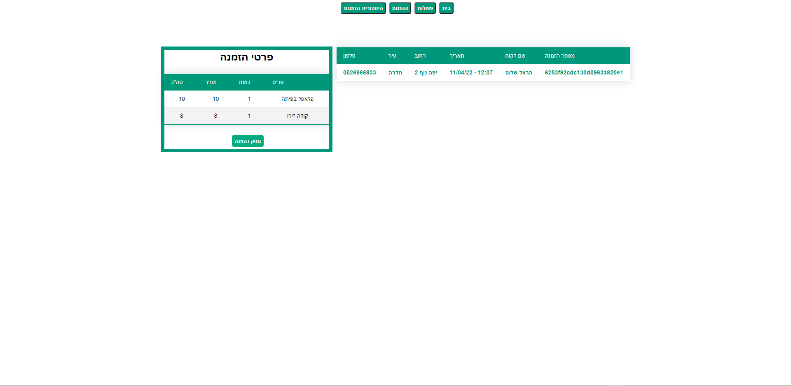

# Restaurant Order

Restaurant Order project using MERN development stack

<!-- **[Live Demo](https://restaurant-ord.herokuapp.com/)** -->

<a href="https://restaurant-ord.herokuapp.com/" target="_blank">  </a>

## Usage

There are two kinds of users -Admin and Customer.

Logging in as a Customer Grants access to the home page where you can order food

Logging in as an Admin Grants access to the home page & control panel.

An admin button will appear in the top toolbar and will allow access to the control panel.

the control panel contains these management options:
Home, Actions, Orders, Order history

### Home Page -

Customer-can order food and able to enter only this page

Admin- can have access to control panel via admin button


### Actions -

The action page allows admin,
view existing meals , update data, delete meals from the menu, add a new meals


click on the button "Add new meal" will open a form and insert the meal to db


### Orders -

Here Admin can see and manege orders ,
click on spcipic order from the list will open Order Details table ,below Admin can confirm the order done ,or cancel the order.

confirn order will save the order in Order history


### Orders History -

Here Admin can see All orders Done to follow up ,
And if not required, can completely delete the order from the databases



## Server API Endpoints

user - {\_id, email, password, isAdmin,tokens}

meals - {\_id, mealId, image,name, description,price}

orders - {\_id, orderedItems, address, user,dateAdded}

<!-- admin - {} -->

| Request                |           |                              | Response                |               |
| ---------------------- | --------- | ---------------------------- | ----------------------- | ------------- |
| Route                  | Method    | Body                         | Success                 | Errors        |
| --------------------   | --------- | ---------------------------- | ----------------------- | ------------- |
| `/api/users`           | `POST`    | {name,email,password}        | { user, token } -201    | 400           |
| `/api/users/login`     | `POST`    | {email,password}             | { user, token } -200    | 400           |
| `/api/users/logout`    | `POST`    | {token}                      | 200                     | 400           |
| `/api/users/logoutAll` | `POST`    | {tokens}                     | 200                     | 400, 401      |
| `/api/users/me`        | `GET`     | {}                           | user -200               | 400, 401, 500 |
| `/api/users/me`        | `PATCH`   | {[name, email, password]}    | user -200               | 400, 401, 500 |
| `/api/users/me`        | `DELETE`  | {}                           | user -200               | 500           |
| `/api/users/:token`    | `GET`     | {}                           | user -200               | 500           |

**Meals**

| Request              |           |                                                        | Response                |               |
| -------------------- | --------- | ------------------------------------------------------ | ----------------------- | ------------- |
| Route                | Method    | Body                                                   | Success                 | Errors        |
| -------------------- | --------- | ------------------------------------------------------ | ----------------------- | ------------- |
| `/api/meals`         | `GET`     | {}                                                     | meals -200              | 500           |
| `/api/meals/:id/`    | `GET`     | {}                                                     | meal -200               | 404, 500      |
| `/api/meals`         | `POST`    | {}                                                     | meal -201               | 400           |
| `/api/meals/:id/`    | `PUT`     | {[mealId, category, image, name, description, price]}  | meal -200               | 400           |
| `/api/meals/:id/`    | `DELETE`  | {}                                                     | meal -200               | 400, 404      |

## Configuration process

In order to run this repo on port localy, add a dev.js file to ./config With the following variables `CONNECT_PASS,JWT_SECRET`

```javascript
module.exports = {
  CONNECT_PASS: "<your mongodb password>",
  JWT_SECRET: "<Password of your choice>",
};
```

In order to run this repo on server you must add the variables `CONNECT_PASS,JWT_SECRET` to Config Vars

## Build process

Run the full-build npm script, then the server script

`npm run full-build`

`npm run server`

This will start the server on port 9000 on your local machine

<!-- In order to run this repo on port 3000, add a .env file with `PORT=3000` -->

## Other Deployment Options

`npm run dev` - Run server and client separately in dev configuration

`npm run server` - Run only the server, will serve on / the last build client

## Technologies

`Back End`

- NodeJS
- Express
- MongoDB (Mongoose)

`Front End`

- ReactJS
- React Router
- Axios - API
- Browser localStorage - User authentication

`Services`

- Authentication-using packages: bcryptjs ,jsonwebtoken
<!-- - Firebase - Google authentication
- Google Extensions - Site extension
- Chrome Alarm API - Extension notifications -->
